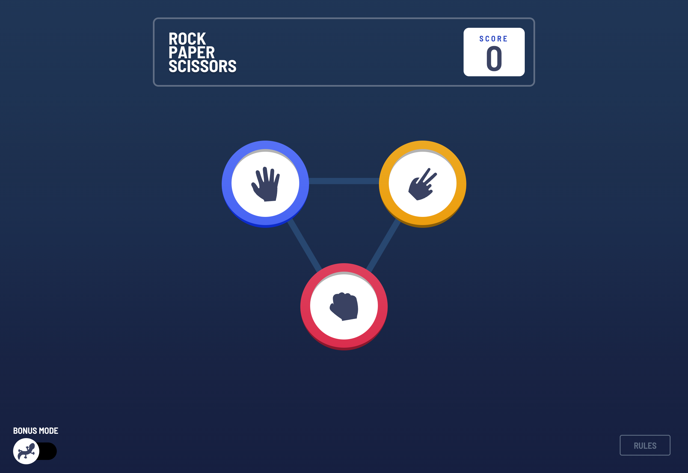
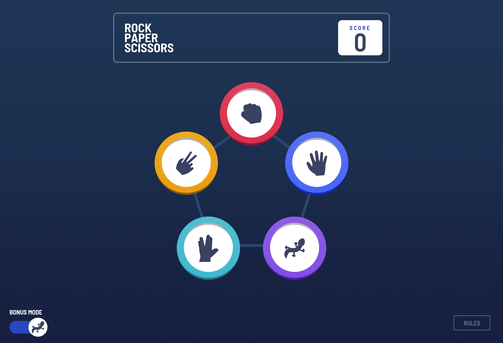
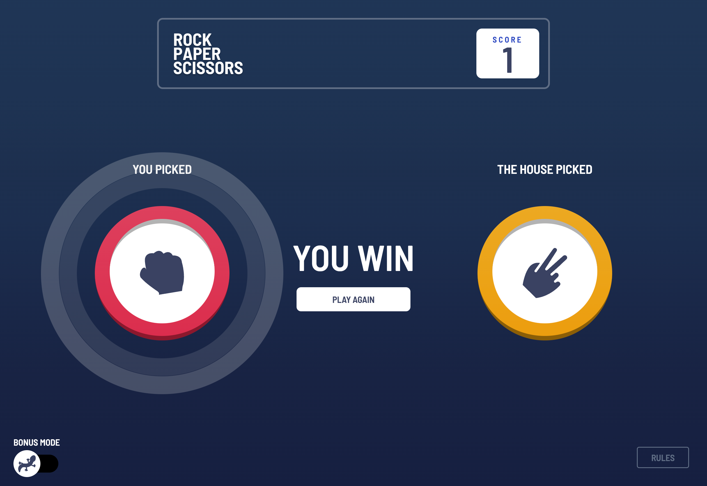
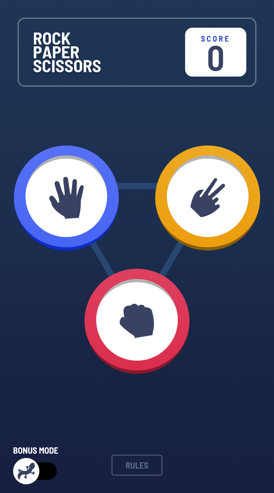
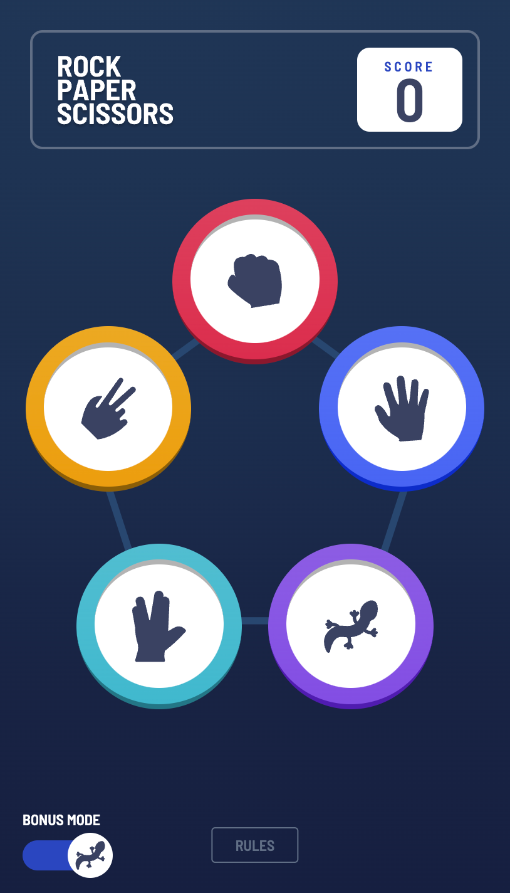
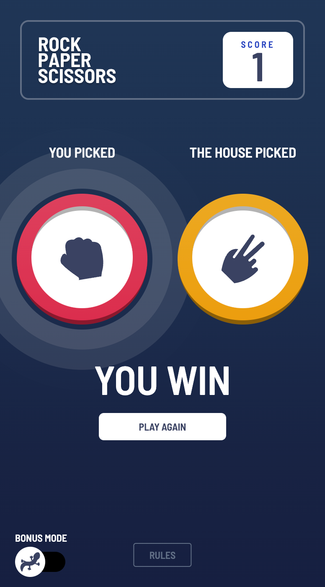

# Frontend Mentor - Rock, Paper, Scissors solution

This is a solution to the [Rock, Paper, Scissors challenge on Frontend Mentor](https://www.frontendmentor.io/challenges/rock-paper-scissors-game-pTgwgvgH). Frontend Mentor challenges help you improve your coding skills by building realistic projects.

## Table of contents

- [Overview](#overview)
  - [The challenge](#the-challenge)
  - [Screenshot](#screenshot)
  - [Links](#links)
- [My process](#my-process)
  - [Built with](#built-with)
  - [What I learned](#what-i-learned)
  - [Useful resources](#useful-resources)
- [Author](#author)

## Overview

### The challenge

Users should be able to:

- View the optimal layout for the game depending on their device's screen size
- Play Rock, Paper, Scissors against the computer
- **Bonus**: Play Rock, Paper, Scissors, Lizard, Spock against the computer _(optional)_

### Screenshots

#### Desktop

#### Mobile

### Links

- Live Site URL: [Live Site](https://rps-game-omeryaz.vercel.app/)

## My process

### Built with

- React
- Typescript
- SCSS
- BEM
- Vite
- Responsive Design

### What I learned

- SCSS - This was my first time using SCSS and it is wonderful. Nesting makes both reading and writing the code a lot easier, mixins and variables are incredible for reusability and I really needed dynamic and reusable styles for this project specifically.

- BEM(Block Element Modifier) - With the powers of SCSS nesting, I tried my best to stick to BEM naming convention. Everything is structured and meaningful with BEM. It is really important to use a structure that other developers are familiar with and can easily understand. BEM and SCSS are the pillars of CSS.

- React Portal - Learned how to create a modal with `createPortal`, a cleaner way to implement a modal without messing with the DOM hierarchy.

- Vercel - I have been using Github Pages to deploy my projects, but something is always broken with Pages. Does not work for SPAs and some of the assets seem to be broken for no reason. Just makes the deployment process a headache. Vercel is easier and works much more smoothly.

### Useful resources

- [Phind - ChatGPT for developers](https://www.phind.com/) - Lately ChatGPT hallucinates a lot, misunderstands prompts time to time and its knowledge cuts off at September 2021. Phind is up-to-date, gives references, understands and answers questions a lot better.
- [Kevin Powell](https://www.youtube.com/channel/UCJZv4d5rbIKd4QHMPkcABCw) - I come to back to this beautiful, wizard of a man again and again. He is great at explaining CSS concepts and teaches writing minimal CSS with maximum responsiveness.

## Author

- Github - [Ömer Yazıcı](https://github.com/omeryaz)
- Frontend Mentor - [@omeryaz](https://www.frontendmentor.io/profile/omeryaz)
